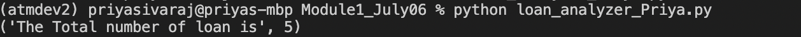

# FinTech Module 1 Submission

The fintech module 1 project is dividied into 5 parts

# Module Part 1

In this part we are going to loop through List of loans to find the lowest cost of the loan. Once found, we want to list all the loans which has the lowest cost below $1000.

You can clone and checkout the module and run using this command.

`python loan_analyze_Priya.py`

Output of the Part 1 will look like this.

